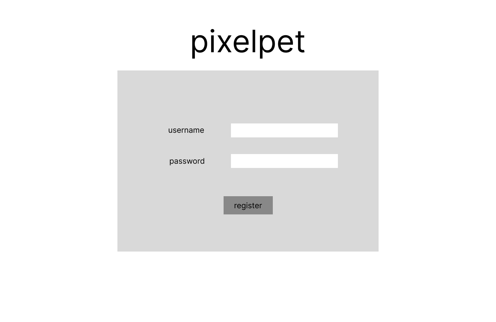
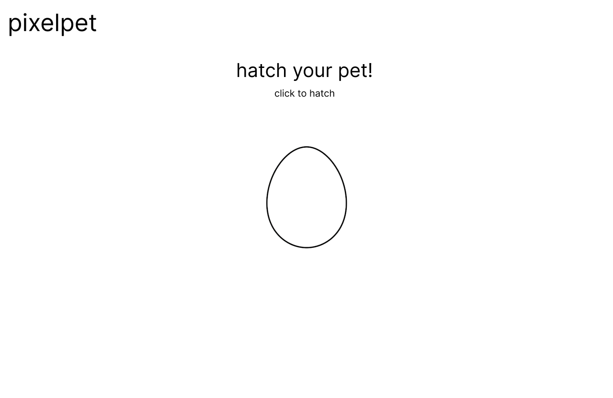
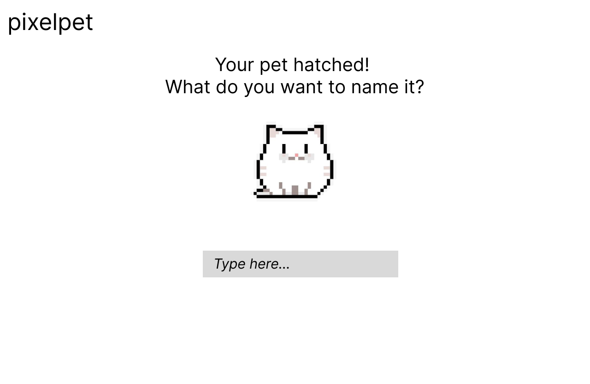
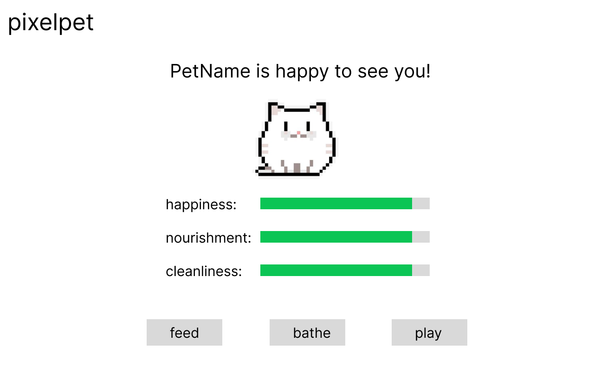

# pixelpet

## Overview
pixelpet is a web application inspired by the classic Tamagotchi children's game. Users are able to take on the role of a pet owner and nurture their own pixelpet -- a virtual pet that users can feed, play with,
and clean. Each pixelpet comes hatched from an egg, and based on the user's care, can grow and thrive.


## Data Model

The application will store Users and Pets.
* each user has 1 pet via reference

An Example User:

```javascript
{
  username: "petlover",
  hash: // a password hash,
  pet: // reference to Pet document
}
```

An Example Pet:

```javascript
{
  name: "Breakfast foods",
  owner: // reference to User document
  age: // Number of days since created
  happiness_level: 90  // Number out of 100
  hunger_level: 10  // Number out of 100
  cleanliness:  100  // Number out of 100

}
```


## [Link to Commented First Draft Schema](db.mjs) 

(__TODO__: create a first draft of your Schemas in db.mjs and link to it)

## Wireframes

(__TODO__: wireframes for all of the pages on your site; they can be as simple as photos of drawings or you can use a tool like Balsamiq, Omnigraffle, etc.)

/login - page to log in


/register - page to log in



/hatch - page to hatch new egg


/name-pet - page to name new pixelpet


/pet - page to show pet stats



## Site map

(__TODO__: draw out a site map that shows how pages are related to each other)

Here's a [complex example from wikipedia](https://upload.wikimedia.org/wikipedia/commons/2/20/Sitemap_google.jpg), but you can create one without the screenshots, drop shadows, etc. ... just names of pages and where they flow to.

## User Stories or Use Cases


1. As a new user, I can register an account.
2. As an existing user, I can log into my account on the website.
3. As a user, I can hatch my own pixelpet.
4. As a user, I can name my pixelpet.
5. As a user, I can feed, clean, and play with my pixelpet to ensure its wellbeing.
6. As a user, I can check on the stats of my pixelpet to see if it is in good condition. 

## Research Topics


* (5 points) Integrate user authentication
    * I plan on using Passport.js for user authentication.
    * Users should only be able to access any pages outside the log-in/register page when properly authenticated. 
* (3 points) Employ configuration management
    * I plan to utilize the dotenv library for configuration management in this project.
    * It is particularly important to me to store certain information, such as database credentials, in an .env file to minimize security risks.
* (2 points) Use CSS framework
    * I plan on using tailwind.css for stylization in this project.
    * I'm interested in tailwind.css in particular because of its extensive documentation and large community of users.

10 points total out of 10 required points


## [Link to Initial Main Project File](app.mjs) 

(__TODO__: create a skeleton Express application with a package.json, app.mjs, views folder, etc. ... and link to your initial app.mjs)

## Annotations / References Used

(__TODO__: list any tutorials/references/etc. that you've based your code off of)

1. [passport.js authentication docs](http://passportjs.org/docs) - (add link to source code that was based on this)
2. [tutorial on vue.js](https://vuejs.org/v2/guide/) - (add link to source code that was based on this)

